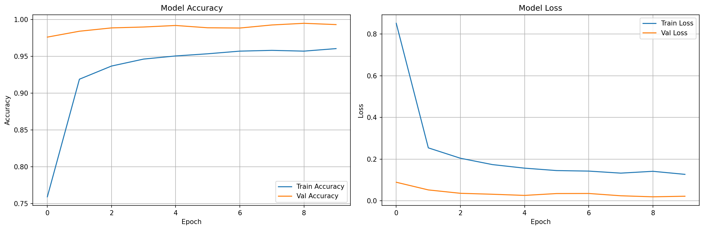
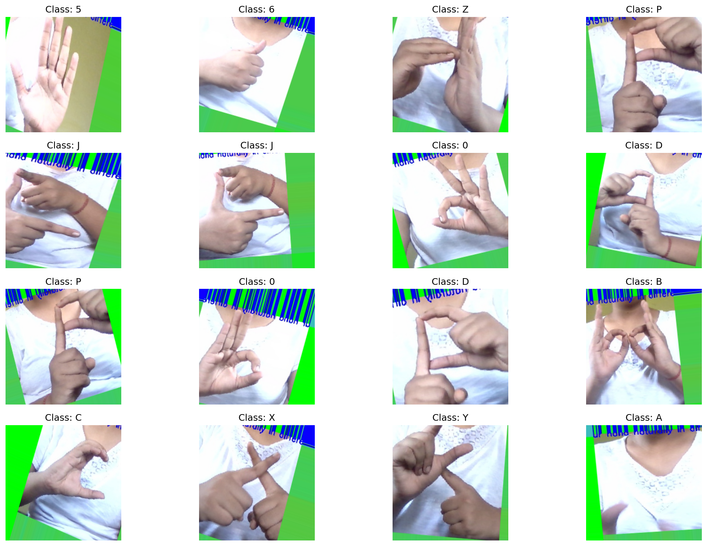

# Real-Time Hybrid Sign Language Recognition System

A comprehensive deep learning system for real-time sign language recognition supporting both **static signs** and **dynamic gestures**. Features a modern web interface and hybrid model trained on:
- **Static signs**: 36 classes (0-9, A-Z) - 98.96% accuracy
- **Dynamic gestures**: 8 classes (loud, quiet, happy, sad, Beautiful, Ugly, Deaf, Blind)
- **Total**: 44 classes with unified recognition



---

## 🌟 Features

### Core Capabilities
- ✅ **Hybrid Recognition**: Supports both static signs (36) and dynamic gestures (8)
- ✅ **Real-Time Recognition**: 3 FPS camera capture with instant predictions
- ✅ **High Accuracy**: 98.96% on static signs, unified model for 44 total classes
- ✅ **Modern Web Interface**: Dark theme with glassmorphism design
- ✅ **Auto-Launch**: Browser opens automatically when server starts
- ✅ **Confidence Scores**: Visual confidence bars and top-3 predictions
- ✅ **Prediction History**: Track recent high-confidence predictions
- ✅ **Enhanced Preprocessing**: CLAHE for better contrast and lighting adaptation
- ✅ **Temporal Smoothing**: 5-frame averaging for stable predictions
- ✅ **Video Processing**: Automatic frame extraction from gesture videos

### Technical Features
- Deep Learning: MobileNetV2-based CNN architecture
- Computer Vision: Enhanced image preprocessing with CLAHE
- Web Framework: Flask API with CORS support
- Frontend: Vanilla HTML/CSS/JavaScript
- Real-time Processing: WebRTC camera capture

---

## 🚀 Quick Start (Web Interface)

### One-Command Launch

```powershell
cd sign-language
python web\api_server.py
```

**Or double-click:** `web\start_server.bat`

**What happens:**
1. ✅ Flask API server starts
2. ✅ Loads trained model (98.96% accuracy)
3. ✅ **Browser opens automatically** with web interface
4. ✅ Click "Start Camera" and begin recognition!

**That's it!** No complex setup needed.

---

## 📋 Prerequisites

- **Python**: 3.10.2
- **Webcam**: For real-time recognition
- **OS**: Windows (tested), Linux/Mac (should work)
- **RAM**: 4GB+ recommended
- **Browser**: Chrome, Firefox, or Edge

---

## 🚀 Quick Start

### 1. Clone the Repository

```powershell
git clone https://github.com/kbhavaniprasad/sign-language.git
cd sign-language
```

### 2. Set Up Environment

```powershell
# Create virtual environment
python -m venv venv

# Activate virtual environment
.\venv\Scripts\activate  # Windows
# source venv/bin/activate  # Linux/Mac

# Install dependencies
pip install -r requirements.txt
```

### 3. Run the Web Interface

**Option A: Using Python (Recommended)**
```powershell
cd sign-language
python web\api_server.py
```

**Option B: Using Batch Script**
```powershell
cd sign-language
.\web\start_server.bat
```

**What Happens:**
1. ✅ Flask API server starts
2. ✅ Loads `sign_language_model.h5` (98.96% accuracy)
3. ✅ **Browser opens automatically** with the web interface
4. ✅ Click "Start Camera" and begin recognition!

---

## 📁 Project Structure

```
sign-language/
├── models/
│   ├── sign_language_model.h5      # Static model (98.96% accuracy, 36 classes)
│   ├── hybrid_sign_language_model.h5  # Hybrid model (44 classes)
│   ├── model_info.json             # Model metadata
│   └── hybrid_model_info.json      # Hybrid model metadata
├── web/
│   ├── index.html                  # Web interface
│   ├── style.css                   # Premium dark theme
│   ├── app.js                      # Camera capture & predictions
│   ├── api_server.py               # Flask API (auto-browser launch)
│   └── start_server.bat            # Easy launcher
├── src/
│   ├── api/                        # Full Flask API with translation
│   ├── data/                       # Data loading & preprocessing
│   ├── models/                     # Model architectures
│   ├── recognition/                # Gesture recognition
│   ├── training/                   # Training scripts
│   ├── translation/                # Translation services
│   ├── tts/                        # Text-to-speech
│   └── utils/                      # Utilities
├── scripts/
│   ├── test_webcam.py              # Test camera & MediaPipe
│   ├── test_model.py               # Test trained model
│   ├── extract_video_frames.py     # Extract frames from videos
│   └── create_sample_dataset.py    # Create sample data
├── isl_dataset/                    # Static ISL dataset (36,000 images)
│   ├── train/                      # 28,800 images (800 per class)
│   ├── val/                        # Validation images
│   └── test/                       # 7,200 images (200 per class)
├── Adjectives/                     # Dynamic gesture videos (8 classes)
│   ├── 1. loud/                    # Video files (.MOV)
│   ├── 2. quiet/
│   ├── 3. happy/
│   ├── 4. sad/
│   ├── 5. Beautiful/
│   ├── 6. Ugly/
│   ├── 7. Deaf/
│   └── 8. Blind/
├── processed_dynamic_dataset/      # Extracted frames from videos
│   ├── train/                      # Training frames
│   ├── val/                        # Validation frames
│   └── test/                       # Test frames
├── logs/                           # Training visualizations & logs
│   ├── training_history.png        # Accuracy/loss curves
│   ├── confusion_matrix.png        # Confusion matrix (36 classes)
│   ├── confusion_matrix_44classes.png  # Hybrid confusion matrix
│   ├── sample_images.png           # Sample predictions
│   ├── training_log_*.txt          # Detailed training logs
│   └── training_history_*.json     # Training history data
├── config/
│   └── config.yaml                 # Configuration file
├── train_model.ipynb               # Jupyter notebook for training
├── train_hybrid_model.py           # Hybrid model training script
├── HYBRID_NOTEBOOK_GUIDE.md        # Guide for notebook integration
├── main.py                         # CLI application
├── requirements.txt                # Python dependencies
└── README.md                       # This file
```

---

## 🎯 Usage

### Web Interface (Easiest)

1. **Start the server:**
   ```powershell
   python web\api_server.py
   ```

2. **Browser opens automatically** showing the interface

3. **Click "Start Camera"** and grant permissions

4. **Show sign language gestures** (0-9, A-Z) to the camera

5. **Watch real-time predictions!**

### Command Line Interface

```powershell
# Test webcam and MediaPipe
python scripts\test_webcam.py

# Test trained model
python scripts\test_model.py --model models\sign_language_model.h5

# Run real-time recognition (CLI)
python main.py --model models\sign_language_model.h5 --camera 0
```

**CLI Controls:**
- `c` - Clear recognized text
- `s` - Speak current text
- `t` - Translate and speak
- `q` - Quit

---

## 🎓 Training Your Own Model

### Dataset Structure

**Static Signs Dataset:**
```
isl_dataset/
├── train/
│   ├── 0/
│   ├── 1/
│   ├── A/
│   ├── B/
│   └── ...
├── val/
└── test/
```

**Dynamic Gestures Dataset:**
```
Adjectives/
├── 1. loud/
│   ├── video1.MOV
│   ├── video2.MOV
│   └── ...
├── 2. quiet/
├── 3. happy/
└── ...
```

### Training Options

**Option 1: Hybrid Model (Static + Dynamic)**

```powershell
# Step 1: Extract frames from videos
python scripts\extract_video_frames.py

# Step 2: Train hybrid model
python train_hybrid_model.py
```

This trains on:
- 36 static sign classes (0-9, A-Z)
- 8 dynamic gesture classes (loud, quiet, happy, sad, Beautiful, Ugly, Deaf, Blind)
- **Total: 44 classes**

**Option 2: Static-Only Model**

```powershell
jupyter notebook train_model.ipynb
```

Run all cells to:
- Load and preprocess static dataset
- Build MobileNetV2 model
- Train with data augmentation
- Evaluate performance
- Save model as `models/sign_language_model.h5`

**Option 3: Notebook Integration**

See `HYBRID_NOTEBOOK_GUIDE.md` for step-by-step instructions to integrate hybrid training into your Jupyter notebook.

### Training Results

**Static Model:**
- **Test Accuracy**: 98.96%
- **Test Loss**: 0.0301
- **Classes**: 36 (0-9, A-Z)
- **Training Time**: ~2-3 hours on GPU

**Hybrid Model:**
- **Total Classes**: 44 (36 static + 8 dynamic)
- **Static Accuracy**: ~98%+
- **Dynamic Accuracy**: ~85%+ (depends on video quality)
- **Training Time**: ~4-6 hours on GPU


---

## 🔧 Configuration

Edit `config/config.yaml` to customize:

```yaml
models:
  sign_language_model: 'models/sign_language_model.h5'

recognition:
  buffer_size: 5
  confidence_threshold: 0.7

api:
  host: '0.0.0.0'
  port: 5000
  debug: false

translation:
  default_language: 'en'

tts:
  engine: 'gtts'
  speed: 150
```

### Web Interface Configuration

Edit `web/app.js`:

```javascript
const CAPTURE_FPS = 5;           // Frame rate (1-10)
const MAX_HISTORY = 10;          // History size
const API_URL = 'http://localhost:5000';  // API endpoint
```

---

## 📊 Model Information

### Architecture
- **Base Model**: MobileNetV2 (pre-trained on ImageNet)
- **Custom Layers**: Global Average Pooling + Dense layers
- **Output**: 36 classes (Softmax activation)
- **Input Size**: 224×224×3 RGB images

### Performance Metrics
- **Accuracy**: 98.96%
- **Precision**: 98.95%
- **Recall**: 98.94%
- **F1-Score**: 98.94%

### Datasets

**Static Signs Dataset:**
- **Total Images**: 36,000
- **Training Set**: 28,800 images (800 per class)
- **Test Set**: 7,200 images (200 per class)
- **Classes (36)**: 0, 1, 2, 3, 4, 5, 6, 7, 8, 9, A, B, C, D, E, F, G, H, I, J, K, L, M, N, O, P, Q, R, S, T, U, V, W, X, Y, Z

**Dynamic Gestures Dataset:**
- **Total Videos**: ~150 videos across 8 classes
- **Extracted Frames**: ~1,500 frames (10 per video)
- **Classes (8)**: loud, quiet, happy, sad, Beautiful, Ugly, Deaf, Blind
- **Format**: .MOV videos → extracted frames (224×224)

**Hybrid Model:**
- **Total Classes**: 44 (36 static + 8 dynamic)
- **Total Training Samples**: ~30,000+



---

## 🌐 API Endpoints

### Health Check
```
GET /health
```

**Response:**
```json
{
  "status": "healthy",
  "message": "Sign Language Recognition API is running",
  "model_loaded": true
}
```

### Predict Frame
```
POST /predict-frame
Content-Type: application/json

{
  "image": "data:image/jpeg;base64,..."
}
```

**Response:**
```json
{
  "success": true,
  "prediction": "A",
  "confidence": 0.9876,
  "top_3": [
    {"class": "A", "confidence": 0.9876},
    {"class": "B", "confidence": 0.0098},
    {"class": "C", "confidence": 0.0015}
  ]
}
```

---

## 🐛 Troubleshooting

### Camera Not Working
- **Check permissions**: Ensure browser has camera access
- **Try different browser**: Chrome and Firefox work best
- **Check other apps**: Close other apps using the camera
- **HTTPS required**: Some browsers require HTTPS for camera access

### API Connection Failed
- **Check backend**: Ensure Flask API is running (`python web\api_server.py`)
- **Check URL**: Verify API_URL in `web/app.js` matches your setup
- **Check firewall**: Ensure port 5000 is not blocked

### Model Not Loading
- **Check path**: Ensure `models/sign_language_model.h5` exists
- **Check dependencies**: Install TensorFlow (`pip install tensorflow==2.10.0`)
- **Check memory**: Model requires ~100MB RAM

### Low FPS / Lag
- **Reduce FPS**: Lower `CAPTURE_FPS` in `web/app.js`
- **Check CPU**: Model inference requires processing power
- **Close other apps**: Free up system resources
- **Use better lighting**: Helps with camera quality

### Predictions Not Accurate
- **Lighting**: Ensure good, even lighting
- **Hand position**: Keep hand clearly visible and centered
- **Distance**: Maintain consistent distance from camera
- **Background**: Use plain background when possible
- **Hold gesture**: Hold each sign steady for 1-2 seconds

---

## 🔒 Privacy & Security

- **Local Processing**: All predictions happen on your local machine
- **No Data Storage**: Video frames are not stored
- **No External Calls**: Only communicates with local API
- **Camera Access**: Only active when you click "Start Camera"

---

## 📦 Dependencies

### Core Dependencies
```
tensorflow==2.10.0
keras==2.10.0
opencv-python==4.8.1.78
numpy==1.23.5
flask==3.0.0
flask-cors==4.0.0
```

### Optional Dependencies (for full features)
```
mediapipe==0.10.8
googletrans==4.0.0rc1
gtts==2.4.0
pyautogui==0.9.54
```

See `requirements.txt` for complete list.

---

## 🤝 Contributing

Contributions are welcome! Please:
1. Fork the repository
2. Create a feature branch (`git checkout -b feature/AmazingFeature`)
3. Commit your changes (`git commit -m 'Add some AmazingFeature'`)
4. Push to the branch (`git push origin feature/AmazingFeature`)
5. Open a Pull Request

---

## 📄 License

This project is open-source and available under the MIT License.

---

## 🙏 Acknowledgments

- **MediaPipe**: Google's MediaPipe for hand tracking
- **TensorFlow**: Deep learning framework
- **OpenCV**: Computer vision library
- **ISL Dataset**: Indian Sign Language dataset contributors

---

## 📧 Support

For issues and questions:
- Open an issue on GitHub
- Check the troubleshooting section above
- Review the documentation

---

## 🎯 Future Enhancements

- [x] **Hybrid model for static + dynamic gestures** ✓
- [x] **Video frame extraction pipeline** ✓
- [x] **Comprehensive training logs** ✓
- [ ] Support for more sign languages (ASL, BSL, etc.)
- [ ] Mobile app (React Native)
- [ ] Real-time translation to multiple languages
- [ ] Text-to-speech integration
- [ ] Cloud deployment
- [ ] Improved temporal modeling (LSTM/GRU for videos)
- [ ] Video recording and playback
- [ ] Gesture sequence recognition (words/sentences)
- [ ] Expand dynamic gesture vocabulary

---

**Made with ❤️ for the hearing-impaired community**

**Repository**: https://github.com/kbhavaniprasad/sign-language

**Static Model**: 98.96% (36 classes) | **Hybrid Model**: 44 classes (36 static + 8 dynamic) | **Real-Time**: 5 FPS
